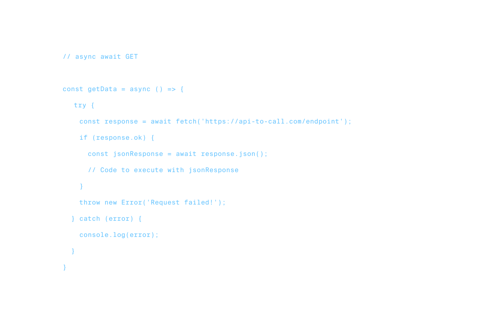
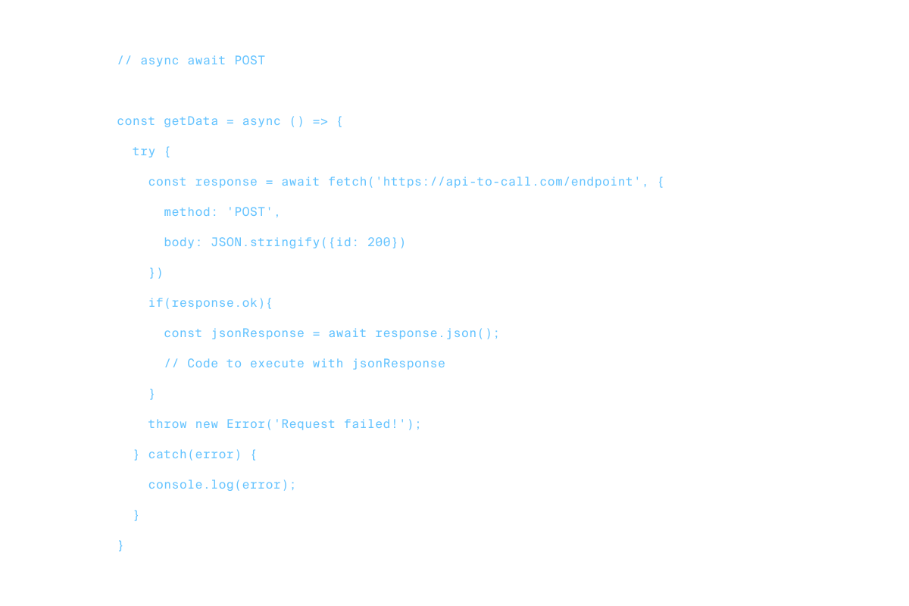

# Requests in JS

## Using `async .. await` and `try .. catch`:

#### `GET` Request:
<div style="margin: auto; width: 100%; background-color: #2d2a2e">


</div>

```js{highlight=11-25}
// Information to reach API
const url = 'https://api.datamuse.com/words?';
const queryParams = 'rel_jja=';

// Selecting page elements
const inputField = document.querySelector('#input');
const submit = document.querySelector('#submit');
const responseField = document.querySelector('#responseField');


// Asynchronous function
const getSuggestions = async () => {
  const wordQuery = inputField.value
  const endpoint = `${url}${queryParams}${wordQuery}`
  try {
    const response = await fetch(endpoint, {cache: 'no-cache'})
    if (response.ok) {
      const jsonResponse = await response.json()
      renderResponse(jsonResponse)
    }
  } catch(error) {
    console.log(error)
  }
}
```

#### `POST` Request:

<div style="margin: auto; width: 100%; background-color: #2d2a2e">


</div>

```js{highlight=11-32}
// information to reach API
const apiKey = process.env.REBRANDLY_API_KEY;
const url = 'https://api.rebrandly.com/v1/links';

// Some page elements
const inputField = document.querySelector('#input');
const shortenButton = document.querySelector('#shorten');
const responseField = document.querySelector('#responseField');

// Asynchronous functions
const shortenUrl = async () => {
	const urlToShorten = inputField.value;
  const data = JSON.stringify({destination: urlToShorten});
  try {
    const response = await fetch(url,
      {
        method: 'POST',
        body: data,
        headers: {
          'Content-type': 'application/json',
          'apikey': apiKey
        }
      }
    );
		if(response.ok){
      const jsonResponse = await response.json();
      renderResponse(jsonResponse);
    }
  } catch (error) {
    console.log(error);
  }
}
```
